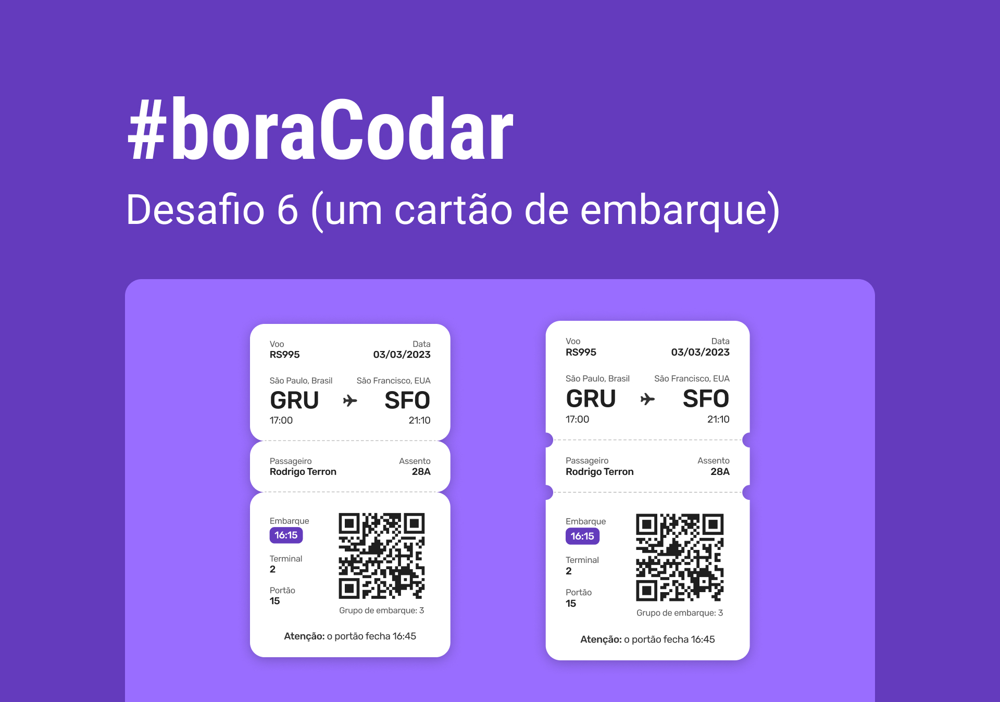

<h1 align="center"> Cartão de Embarque </h1>

Projeto desenvolvido durante o desafio 06 do   
#boraCodar promovido pela Rocketseat  

  <a href="#-tecnologias">Tecnologias</a>&nbsp;&nbsp;&nbsp;|&nbsp;&nbsp;&nbsp;
  <a href="#-projeto">Projeto</a>&nbsp;&nbsp;&nbsp;|&nbsp;&nbsp;&nbsp;
  <a href="#-layout">Layout</a>&nbsp;&nbsp;&nbsp;|&nbsp;&nbsp;&nbsp;
  

 

  

## 🚀 Tecnologias

Esse projeto foi desenvolvido utilizando:

- HTML e CSS
- Git e Github
- Figma

## 💻 Sobre o projeto

O projeto simula um cartão de embarque de uma companhia aérea, com detalhes e informações diferentes.

- [Você pode acessar o projeto clicando aqui](https://hecro.github.io/boarding-ticket/) ou clicando no link no topo desse mesmo repositório.

## 🔖 Layout

Você pode visualizar o layout do projeto [clicando aqui](https://www.figma.com/community/file/1205146101173113980). Você vai precisar de uma conta no [Figma](https://figma.com) para acessar.

---

Feito com 💜 by Lucas Hecro
